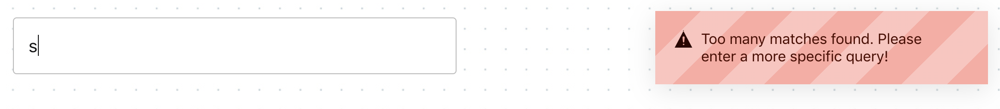

**Читать на других языках: [Русский](README.md), [Українська](README.ua.md).**

# Критерии приема

- Создан репозиторий `goit-js-hw-12-countries`.
- При сдаче домашней работы есть две ссылки: на исходные файлы и рабочую
  страницу на GitHub pages.
- При посещении рабочей страницы (GitHub pages) задания, в консоли нету ошибок и
  предупреждений.
- Имена переменных и функций понятные, описательные.
- Проект собран с помощью
  [parcel-project-template](https://github.com/goitacademy/parcel-project-template).
- Код отформатирован с помощью `Prettier`.
- Добавь минимальную стилизацию.
- Есть файл `fetchCountries.js` с дефолтным экспортом функции
  `fetchCountries(searchQuery)`, возвращающей промис с массивом стран, результат
  запроса к API.

## Поиск стран

Создай небольшое приложение поиска данных о стране по ее частичному или полному
имени. Используй [Rest Countries API](https://restcountries.eu/), а именно
ендпоинт [/name](https://restcountries.eu/#api-endpoints-name), возвращающий
массив объектов стран попавших под критерий поиска.

Достаточно чтобы приложение работало для большинства стран. Некоторые страны,
такие как `Sudan`, могут создавать проблемы, поскольку название страны является
частью названия другой страны, `South Sudan`. Не нужно беспокоиться об этих
исключениях.

Интерфейс очень простой. Название страны для поиска пользователь вводит в
текстовое поле.

⚠️ **ВНИМАНИЕ!** HTTP-запросы на бекенд происходят не по сабмиту формы, формы
нет, а при наборе имени страны в инпуте, то есть по событию `input`. Но делать
HTTP-запрос при каждом нажатии клавиши нельзя, так как одновременно получится
много HTTP-запросов которые будут выполняться в непредсказуемом порядке (race
conditions). Поэтому на обработчик события необходимо применить подход
`debounce` и делать HTTP-запрос спустя `500мс` после того, как пользователь
перестал вводить текст. Используй npm-пакет
[lodash.debounce](https://www.npmjs.com/package/lodash.debounce).

Если бекенд вернул больше чем 10 стран подошедших под критерий введенный
пользователем, в интерфейсе отображается нотификация о том, что необходимо
сделать запрос более специфичным. Для оповещений используй плагин
[pnotify](https://github.com/sciactive/pnotify).



Если бекенд вернул от 2-х до 10-х стран, под инпутом отображается список имен
найденных стран.


Если бекенд вернул массив с одной страной, в интерфейсе рендерится разметка с
данными о стране: название, столица, население, языки и флаг.


///////////////////////////////////////////////////////////////////////////////////////////////////////////////
# Parcel boilerplate

## Скрытые файлы

Включите отображение скрытых файлов и папок в проводнике своей операционной системы, иначе вы не
сможете выбрать и скопировать себе файлы настроек проекта, имена которых начинаются с точки.

## Зависимости

На компьютере должена быть установлена LTS-версия [Node.js](https://nodejs.org/en/) со всеми
дополнительными инструментами кроме **Chocolatey** - его ставить не нужно.

## Перед началом работы

Один раз на проект установить все зависимости.

```shell
npm ci
```

### Разработка

Запустить режим разработки.

```shell
npm run dev
```

Во вкладке браузера перейти по адресу [http://localhost:1234](http://localhost:1234).

### Деплой

Сборка будет автоматически собирать и деплоить продакшен версию проекта на GitHub Pages, в ветку
`gh-pages`, каждый раз когда обновляется ветка `main`. Например, после прямого пуша или принятого
пул-реквеста. Для этого необходимо в файле `package.json` отредактировать поле `homepage` и скрипт
`build`, заменив `имя_пользователя` и `имя_репозитория` на свои.

```json
"homepage": "https://имя_пользователя.github.io/имя_репозитория",
"scripts": {
  "build": "parcel build src/*.html --public-url /имя_репозитория/"
},
```

На всякий случай стоит зайти в настройки репозитория `Settings` > `Pages` и убедиться что продакшен
версии файлов раздаются из папки `/root` ветки `gh-pages`.

Через какое-то время живую страницу можно будет посмотреть по адресу указанному в отредактированном
свойстве `homepage`, например
[https://goitacademy.github.io/parcel-project-template](https://goitacademy.github.io/parcel-project-template).

## Файлы и папки

- Все паршалы файлов стилей должны лежать в папке `src/sass` и импортироваться в
  `src/sass/main.scss`
- Изображения добавляйте в папку `src/images`, заранее оптимизировав их. Сборщик просто копирует
  используемые изображения чтобы не нагружать систему оптимизацией картинок, так как на слабых
  компьютерах это может занять много времени.
